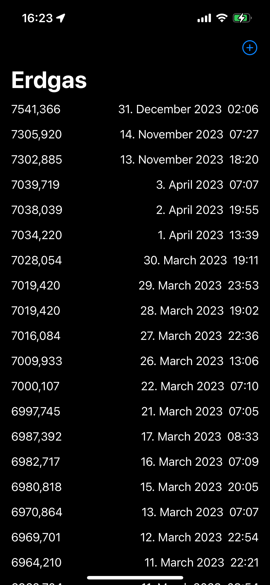
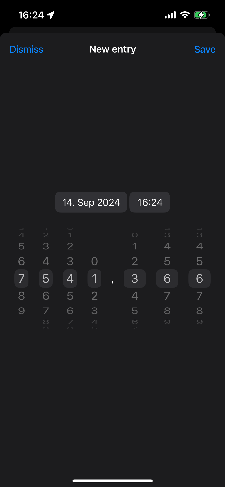

# Erdgas

Erdgas is a small utility to track your energy consumption (e.g., gas, electricity, water). It uses [NumberWheelPicker](https://github.com/kublaios/NumberWheelPicker) to allow you to input your readings with ease.

I initially created this app to track our gas consumption over winter, but the building has switched to a different infrastructure and we no longer have the gas meter. It is unlikely that I will continue to develop this app, but I am happy to accept contributions if you find it useful.

A few things I had in mind for future development:
- Data visualization (e.g., charts)
- Update/delete functionality
- Data export (e.g., CSV) - it is currently stored in a JSON in `AppData/Documents` directory
- Reading from camera (there are interesting projects on GitHub that can read the meter from a photo, VisionKit could also be an option)
- Notifications for reading reminders

## Features
- Fully SwiftUI and accessible
- Enter whole and decimal numbers using a scroll picker
- List historical data
- Remember last entry when adding a new one

### Sample stored data
```json
[
    {
        "value":6819.838,
        "date":697413000,
        "id":"26B885AB-E676-4FDB-ADF2-7892F4623437"
    },
    {
        "id":"3EA37634-440B-49AE-86D7-B7C1263E0638",
        "value":6822.72,
        "date":697449420
    }
]
```

## Screenshots

### Home screen


### New entry screen


## Contribution
Feel free to open issues or pull request for improvements or bug fixes.

## License
This project is released under the MIT license. See [LICENSE](LICENSE) for details.
